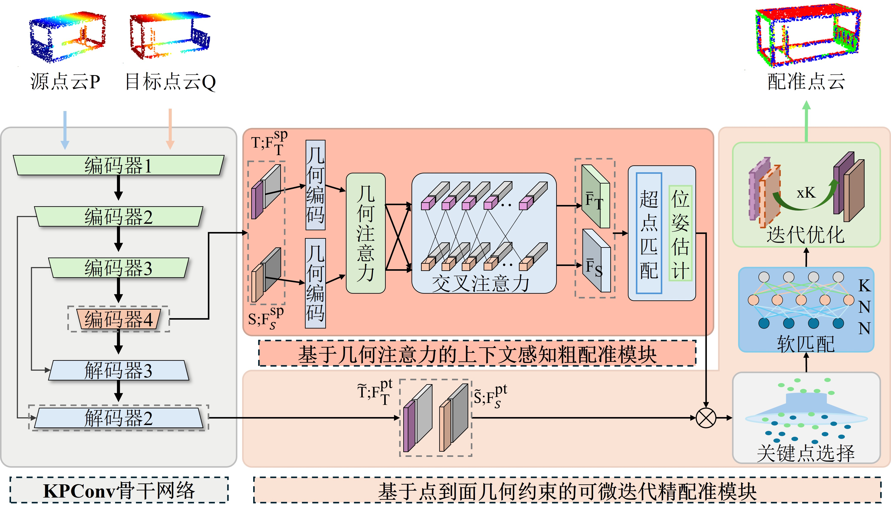

# MiC Multi-View Point Cloud Registration Framework

**Repository for Chapter 3 of the paper**  

## 简介
本仓库提供针对钢结构模块化集成建筑（MiC）场景的多视图点云配准完整实现，包括：
- 仿真驱动的多视角激光雷达扫描建模与布局优化
- 基于几何注意力与点到面约束的成对配准网络
- 位姿图（Pose Graph Optimization）全局一致性优化

主要目标是为钢结构MiC模块生成高质量、几何完整的融合点云，为后续Scan-BIM对齐与尺寸测量提供可靠数据基础。
